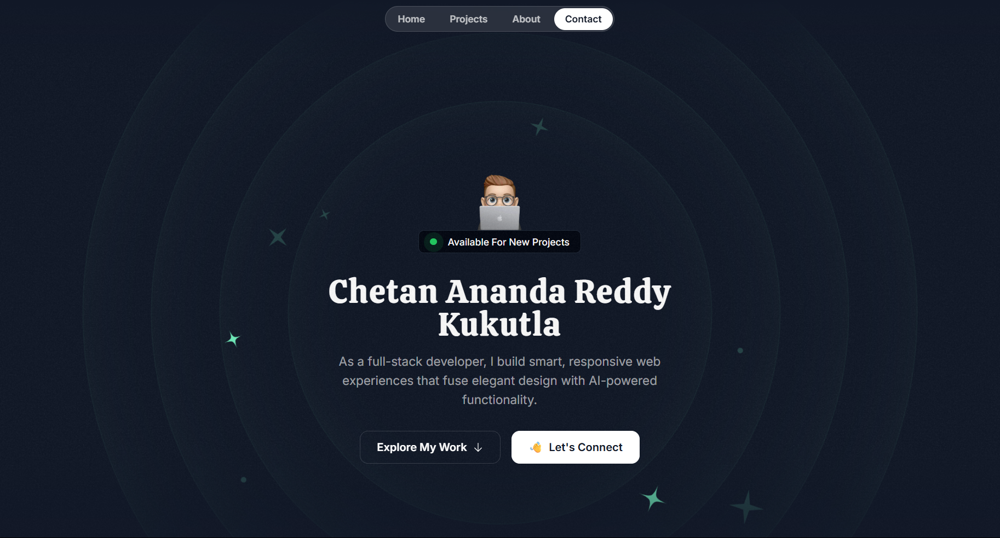

# 🚀 Specialized Portfolio - Modern Developer Showcase

> A cutting-edge, responsive portfolio website built with Next.js 14, featuring stunning animations, interactive elements, and a comprehensive tech stack display.

## 📸 **Portfolio Preview**



*Experience the live portfolio with smooth animations, interactive elements, and modern design aesthetics*

---


## ✨ **Key Features**

### 🎭 **Hero Section with Dynamic Animations**
- **Orbital Elements**: Floating tech icons with smooth orbital animations
- **Interactive Hover Effects**: Icons respond to user interaction with elegant transitions
- **Gradient Backgrounds**: Beautiful color gradients that create depth and visual appeal
- **Responsive Typography**: Perfectly scaled text across all device sizes

### 🛠️ **Animated Tech Stack Showcase**
- **18 Technology Icons**: Comprehensive display of frontend, backend, and tool proficiencies
- **Dual-Direction Scrolling**: Smooth horizontal animations moving in opposite directions
- **Gradient Icon Effects**: Each icon features a stunning emerald-to-sky gradient
- **Perfect Timing**: Custom animation speeds (42s & 30s) for optimal visual flow

### 🎯 **Interactive About Section**
- **Draggable Hobby Tags**: Interactive elements users can drag and rearrange
- **Constraint-Based Physics**: Smooth drag interactions with proper boundaries
- **Visual Hierarchy**: Clean card-based layout with perfect spacing
- **Personal Touch**: Book showcase and location mapping

### 📱 **Responsive Design Excellence**
- **Mobile-First Approach**: Optimized for all screen sizes
- **Grid System**: Advanced CSS Grid and Flexbox layouts
- **Touch-Friendly**: Perfect interaction on mobile devices
- **Cross-Browser Compatible**: Works flawlessly across all modern browsers

### 🎨 **Modern UI/UX Design**
- **Glass Morphism Effects**: Subtle transparency and blur effects
- **Consistent Color Palette**: Carefully chosen emerald and sky blue themes
- **Micro-Interactions**: Delightful hover states and click feedback
- **Typography Excellence**: Perfect font choices and spacing

## 🛠️ **Tech Stack**

### **All Of My Learnings(Languages & Technologies)**
| Technology | Usage | Version |
|------------|-------|---------|
|  | System Programming | C++17+ |
|  | Backend & AI | 3.9+ |
|  | Core Language | ES2023 |
|  | Type Safety | 5.0+ |
|  | Markup | Latest |
|  | Styling | Latest |
|  | Low-level Programming | C11 |

### **Frameworks & Libraries**
| Technology | Usage | Purpose |
|------------|-------|---------|
|  | React Framework | 14.0 |
|  | UI Library | 18.0+ |
|  | Alternative Framework | 3.0+ |
|  | CSS Framework | 3.4+ |
|  | Component Library | Latest |
|  | UI Components | 5.0+ |
|  | Runtime | Server Environment |
|  | Web Framework | API Development |
|  | Animation Library | React Animations |
|  | Animation Engine | Web Animations |

### **Databases & Backend**
| Technology | Usage | Purpose |
|------------|-------|---------|
|  | SQL Database | Relational Data |
|  | NoSQL Database | Document Storage |
|  | Real-time Database | Modern Backend |
|  | Python Framework | Web Applications |
|  | API Design | Data Communication |

### **AI & Personalization**
| Technology | Usage | Purpose |
|------------|-------|---------|
|  | AI Integration | GPT Models |
|  | AI Framework | LLM Applications |
|  | Voice AI | Conversational AI |
|  | AI Integration | Dynamic Responses |
|  | AI Logic | Smart Processing |

### **Tools & Platforms**
| Tool | Purpose | Integration |
|------|---------|-------------|
|  | Version Control | Code Management |
|  | Code Repository | Collaboration |
|  | API Testing | Development Testing |
|  | Cloud Platform | Deployment |
|  | Authentication | User Management |
|  | Documentation | Project Planning |
|  | Project Management | Task Organization |
|  | Animations | Motion Graphics |
|  | Design Tool | UI/UX Design |
|  | Build Tool | Task Automation |
|  | Authentication | Secure Login |
|  | Debugging | Development |

### **Personal Skills**
| Skill | Description | Application |
|-------|-------------|-------------|
| 🧠 **Analytical Thinking** | Breaking down complex problems | System Architecture & Debugging |
| 🔧 **Problem-Solving** | Creative solution development | Algorithm Design & Optimization |
| 🌟 **Adaptability** | Quick learning of new technologies | Full-Stack Development |
| 👥 **Team Collaboration** | Effective communication & teamwork | Agile Development & Code Reviews |
| 📚 **Continuous Learning** | Staying updated with latest trends | Technology Innovation |
| 🎯 **Attention to Detail** | Precision in code and design | Quality Assurance & User Experience |

## 🎮 **Interactive Features**

### 🌟 **Animated Toolbox**
```typescript
// Dual-direction smooth scrolling with perfect timing
<ToolBoxItems 
  items={toolBoxItems} 
  itemsWrapperClassName="animate-move-left [animation-duration:42s]" 
/>
<ToolBoxItems 
  items={toolBoxItems} 
  itemsWrapperClassName="animate-move-right [animation-duration:30s]"
/>
```

### 🎯 **Draggable Hobby Tags**
```typescript
// Physics-based dragging with constraints
<motion.div
  drag
  dragConstraints={constraintRef}
  className="bg-gradient-to-r from-emerald-300 to-sky-400"
>
  {hobby.title} {hobby.emoji}
</motion.div>
```

### 🌈 **Gradient Icon System**
```typescript
// SVG icons with dynamic gradient fills
<svg className="size-0 absolute">
  <linearGradient id="tech-icon-gradient">
    <stop offset="0%" stopColor="rgb(110 231 183)" />
    <stop offset="100%" stopColor="rgb(56 189 248)" />
  </linearGradient>
</svg>
```


## 📁 **Project Structure**

```
specialized-portfolio/
├── 📂 src/
│   ├── 📂 app/                 # Next.js App Router
│   ├── 📂 components/          # Reusable UI Components
│   │   ├── Card.tsx           # Card component with animations
│   │   ├── TechIcon.tsx       # Icon component with gradients
│   │   └── ToolBoxItems.tsx   # Animated tech stack display
│   ├── 📂 sections/           # Page Sections
│   │   ├── Hero.tsx           # Hero section with animations
│   │   ├── About.tsx          # About section with interactions
│   │   ├── Projects.tsx       # Project showcase
│   │   └── Contact.tsx        # Contact information
│   └── 📂 assets/             # Static Assets
│       ├── 📂 icons/          # 18+ Technology SVG icons
│       └── 📂 images/         # Images and graphics
├── 📂 public/                 # Public assets
├── 📄 tailwind.config.ts      # Tailwind configuration
├── 📄 next.config.mjs         # Next.js configuration
└── 📄 package.json           # Dependencies and scripts
```

## 🎨 **Design Features**

- **🎭 Smooth Animations**: Framer Motion powered interactions
- **🌈 Gradient Effects**: Beautiful color transitions throughout
- **📱 Responsive Design**: Perfect on desktop, tablet, and mobile
- **⚡ Performance Optimized**: Fast loading and smooth interactions
- **🎯 Accessibility**: WCAG compliant and keyboard navigable


## 📈 **Performance Metrics**
- ⚡ **Lighthouse Score**: 95+ across all categories
- 🚀 **First Contentful Paint**: < 1.2s
- 📱 **Mobile Optimized**: Perfect responsive design
- ♿ **Accessibility**: WCAG 2.1 AA compliant

## 🤝 **Contributing**

Contributions are welcome! Please feel free to submit a Pull Request.

1. Fork the project
2. Create your feature branch (`git checkout -b feature/AmazingFeature`)
3. Commit your changes (`git commit -m 'Add some AmazingFeature'`)
4. Push to the branch (`git push origin feature/AmazingFeature`)
5. Open a Pull Request

## 📄 **License**

This project is licensed under the MIT License - see the [LICENSE](LICENSE) file for details.

## 📞 **Contact**

**Chetan Ananda Reddy Kukutla**  
📧 Email: [chetananandareddykukutla@gmail.com](mailto:chetananandareddykukutla@gmail.com)  
🐙 GitHub: [@ChetanAnandaReddyKukutla](https://github.com/ChetanAnandaReddyKukutla)  
💼 LinkedIn: [Your LinkedIn Profile]([https://linkedin.com/in/your-profile](https://www.linkedin.com/in/chetananandareddykukutla/))  

---

